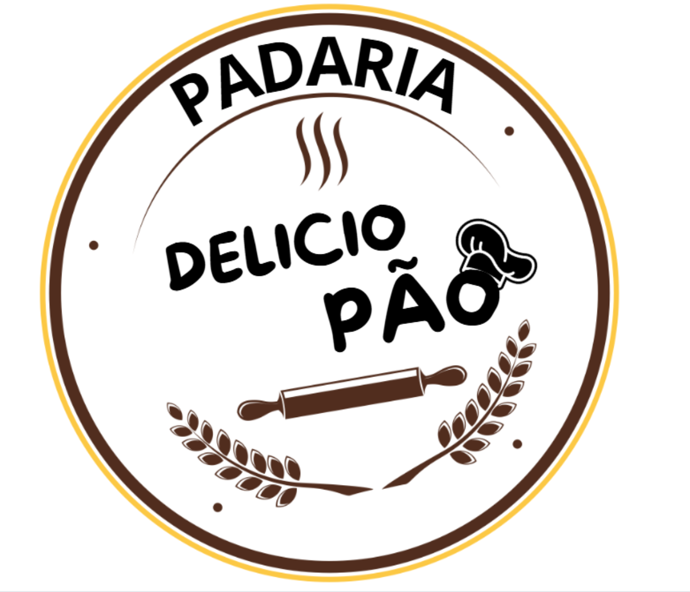

# *Atividade 02:*

### a - Criar uma pasta chamada “padariaDelicioPao”; 
### b - Criar o briefing; 
### c - Criar um site utilizando os recursos HTML e CSS. 

# BRIEFING PRELIMINAR

## SEU LOGOTIPO:
  

## PÚBLICO-ALVO:
Pessoas no geral.

## OBJETIVOS DO WEB SITE:

## "IMAGEM” A SER TRANSMITIDA:
Acolhimento e qualidade.

## CONTEÚDO DINÂMICO? QUAL?:
Sim, o dono terá autonomia

## CONCORRENTES (vantagens / desvantagens):
Padaria do Horto  
 _vantagens_: 
 _desvantagens_:  
Padaria Guerra 
_vantagens_: 
_desvantagens_:  
Padaria Bom Pão 
_vantagens_: 
_desvantagens_:  

## REFERÊNCIAS (web sites):
Padaria do Horto

## OBSERVAÇÕES: